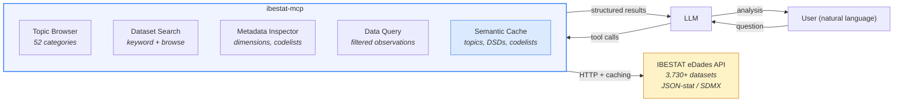

# ibestat-mcp

An MCP server that gives LLMs analytical access to 3,730+ public datasets from the Balearic Islands — tourism, population, economy, housing, environment, and more.

Built on [IBESTAT](https://ibestat.es)'s eDades API. Designed for [Claude Desktop](https://claude.ai), [Claude Code](https://claude.com/claude-code), and any MCP-compatible client.

## Why not just call the API directly?

IBESTAT's eDades API is powerful but opaque. It serves JSON-stat over REST with numeric codes, nested hierarchies, and no search — you need to already know what you're looking for.

This MCP server adds a **semantic layer** that turns the raw API into something an LLM can reason with:

| Challenge with the raw API | What ibestat-mcp does |
|---|---|
| No browsable catalog — you need dataset IDs upfront | **Topic tree** with 52 thematic categories the LLM can browse |
| Dimension codes are cryptic (`07040`, `_T`, `A`) | **Codelist exploration** reveals what codes mean and how they're structured |
| Filtering requires exact dimension IDs and value codes | **Dataset inspection** exposes dimensions, valid values, and codelist references |
| No way to discover related datasets | **Cross-dataset discovery** through shared topics and keyword search |
| Structural metadata requires separate API calls | **Automatic caching** of topics, codelists, and data structure definitions |

The result: an LLM can go from a plain-language question to a data-backed answer in a single conversation — without the user knowing a single dataset ID or API endpoint.

### Real-world example: Does tourism drive waste?

A user asks: *"Is there a correlation between tourist arrivals and waste generation in the Balearic Islands?"*

The LLM browses topics, finds the waste dataset under "Territori i medi ambient", searches for tourism data, inspects both datasets' dimensions, retrieves filtered time series, and cross-references them:

| Year | Waste (kg/capita) | Tourists (millions) |
|------|-------------------|---------------------|
| 2018 | 828.8 | 16.55 |
| 2019 | 757.9 | 16.48 |
| 2020 | 568.3 | 3.11 |
| 2021 | 605.0 | 8.68 |

Peak tourism = peak waste. The 2020 pandemic collapse (-81% tourists) triggered a 25% drop in waste — a natural experiment proving the link.

This required six tool calls across two datasets. No API docs consulted. No dataset IDs memorized.

[Full worked example with all steps](examples/waste-tourism-correlation.md)

## Architecture



The semantic layer (blue) sits between the LLM and the raw API. It provides discovery, exploration, and caching so the LLM can navigate data autonomously. Structural metadata is fetched once and cached for the session.

## Installation

Not yet on PyPI. Install directly from GitHub:

```bash
pip install git+https://github.com/JavaLavadora/ibestat-mcp.git
```

Or for local development:

```bash
git clone https://github.com/JavaLavadora/ibestat-mcp.git
cd ibestat-mcp
pip install -e ".[dev]"
```

## Configuration

### Claude Desktop

Add to your `claude_desktop_config.json`:

```json
{
  "mcpServers": {
    "ibestat": {
      "command": "ibestat-mcp"
    }
  }
}
```

Config file location:
- macOS: `~/Library/Application Support/Claude/claude_desktop_config.json`
- Linux: `~/.config/Claude/claude_desktop_config.json`
- Windows: `%APPDATA%\Claude\claude_desktop_config.json`

### Claude Code (CLI)

Add to your project settings (`.claude/settings.json`):

```json
{
  "mcpServers": {
    "ibestat": {
      "command": "ibestat-mcp"
    }
  }
}
```

Or via the CLI:

```bash
claude mcp add ibestat -- ibestat-mcp
```

## Tools

| Tool | Description | Cached |
|------|-------------|--------|
| `browse_topics` | Browse IBESTAT's thematic catalog (52 categories) | Yes |
| `list_datasets_by_topic` | List all datasets under a category | Yes |
| `search_datasets` | Search datasets by keyword | No |
| `get_dataset_info` | Get dataset dimensions, filter values, and codelist IDs | DSD cached |
| `get_codelist` | Explore hierarchical codes (e.g., Region > Island > Municipality) | Yes |
| `get_data` | Fetch data rows with optional dimension filters | No |

### Recommended workflow

1. **Browse** -- `browse_topics` to see what domains IBESTAT covers
2. **List** -- `list_datasets_by_topic` to find datasets in a category
3. **Search** -- *(alternative)* `search_datasets` when you already know what to look for
4. **Inspect** -- `get_dataset_info` to understand dimensions and get codelist IDs
5. **Explore** -- `get_codelist` to discover valid filter values at all hierarchy levels
6. **Query** -- `get_data` with precise filters from the previous steps

### Example prompts

Try asking your LLM:

- "What was the population of Palma in 2024?"
- "Show me tourism statistics for the Balearic Islands"
- "Compare employment rates across Mallorca, Menorca, and Ibiza"
- "What are the latest housing price trends in the Balearic Islands?"
- "How many tourists visited Ibiza last year?"

## MCP Prompts

Five built-in prompts help LLMs navigate IBESTAT data without requiring users to know the tool workflow:

| Prompt | Description | Required args |
|--------|-------------|---------------|
| `explore_topic` | Explore a statistical topic end-to-end | `topic` |
| `query_dataset` | Query a specific dataset by ID | `dataset_id` |
| `compare_municipalities` | Compare data across Balearic municipalities | `topic` |
| `time_series` | Show trends over time | `topic` |
| `discover_available_data` | Onboarding: what data does IBESTAT have? | *(none)* |

All prompts accept an optional `language` argument (`ca`, `es`, or `en`, default `ca`).

## Data Language Note

All tools accept a `language` parameter:

- `ca` -- Catalan (default). Labels like "Territori", "Poblacio".
- `es` -- Spanish. Labels like "Territorio", "Poblacion".
- `en` -- English. Labels like "Reference area", "Population".

Search works best in Catalan or Spanish since dataset names are stored in those languages. Use `poblacio` not "population", `turisme` not "tourism".

## Troubleshooting

**Search returns no results for English terms**
Dataset names are indexed in Catalan/Spanish. Use Catalan stems: `poblaci` (population), `turisme` (tourism), `atur` (unemployment), `habitatge` (housing). Partial matches work.

**`get_data` is slow or returns too much data**
Without filters, all observations are fetched — some datasets have hundreds of thousands of rows. Always call `get_dataset_info` first, then pass `filters` to narrow by time period, territory, etc.

**"IBESTAT service is unavailable" error**
The IBESTAT API is a public government service with no SLA. Wait a few minutes and retry. If persistent, check that `https://ibestat.es` is reachable from your network.

**"Dataset not found" error**
The dataset ID may be wrong or the dataset may have been retired. Use `search_datasets` to find the current valid ID — copy the `id` field exactly as returned.

**Filter keys seem to be ignored (unfiltered data returned)**
Filters require dimension IDs (`TIME_PERIOD`, `TERRITORIO`) and value codes (`07040`, `_T`), not human-readable labels. Use the `id` and `code` fields from `get_dataset_info`, not `name` or `label`.

**Column names and values are not in English**
The server returns labels in Catalan by default. Set the `language` parameter to `es` for Spanish or `en` for English.

## Development

```bash
pip install -e ".[dev]"
pytest -m "not e2e"   # unit tests (fast, no network)
pytest -m e2e         # end-to-end (hits real API)
pytest                # all
```

## License

MIT -- see [LICENSE](LICENSE)
